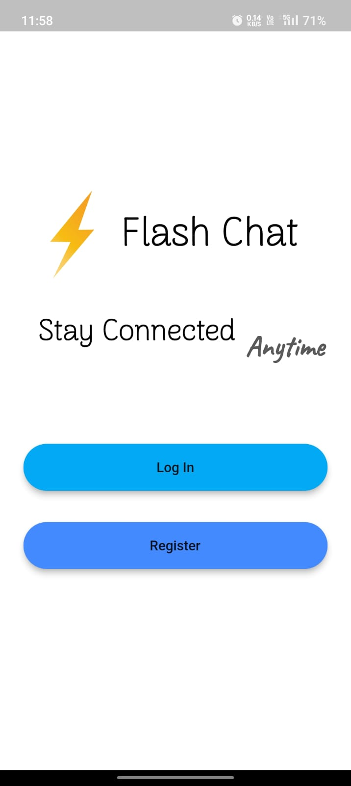
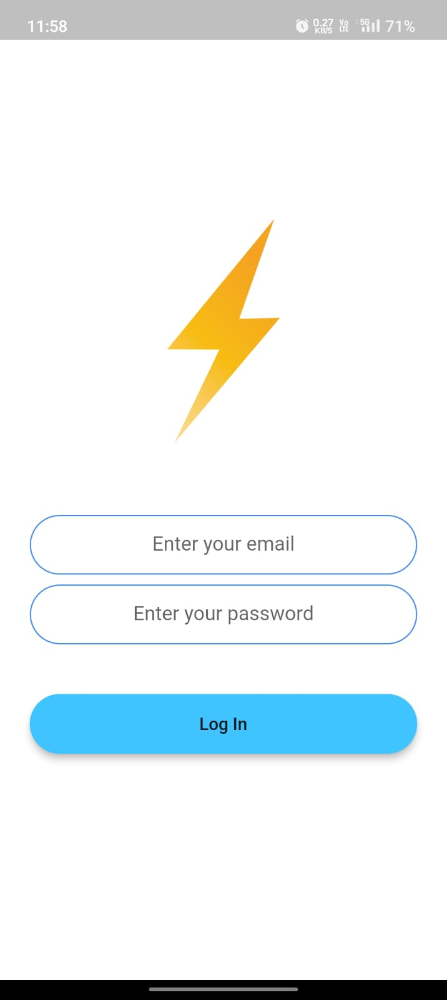

Title: FlashChat

Description: This GitHub repository contains a chat application built using Flutter and Firebase. The app enables real-time communication between users through a secure and efficient messaging platform. Leveraging the power of Flutter's cross-platform framework and Firebase's robust backend services, this chat app offers a seamless experience for both Android and iOS devices.

Key Features:

User Authentication: The app incorporates Firebase Authentication to enable users to register, log in, and securely authenticate themselves.
Real-time Messaging: Utilizing Firebase Cloud Firestore, the app allows users to send and receive messages in real-time, ensuring instant and smooth communication.
User Profiles: Users can create profiles.

App Preview - 
| Demo pic 1               | Demo pic 2             |
| ---------------------- | ---------------------- |
|  |  |

